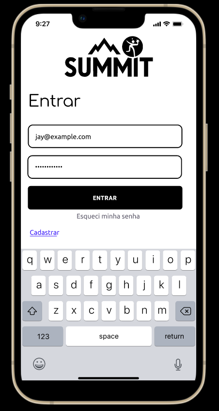
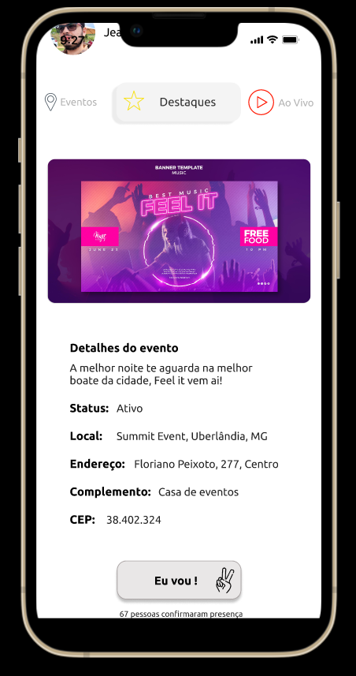

# Summit

## Descrição

Summit é uma solução inovadora para quem busca explorar eventos de entretenimento de maneira prática e interativa. Com recomendações personalizadas baseadas nos interesses do usuário, funcionalidades de interação social que permitem conexões entre participantes e uma visualização imersiva dos locais dos eventos, o aplicativo oferece uma experiência completa e segura para os usuários.

## Tecnologias Utilizadas

Summit foi desenvolvido utilizando as seguintes tecnologias:

- **[React Native](https://reactnative.dev/)**: Framework para desenvolvimento de aplicativos móveis.
- **[Expo](https://expo.dev/)**: Ferramenta e plataforma para desenvolvimento de aplicativos React Native.
- **[TypeScript](https://www.typescriptlang.org/)**: Superset do JavaScript que adiciona tipagem estática.
- **[Native Base](https://nativebase.io/)**: Biblioteca de componentes para React Native.
- **[React Navigation](https://reactnavigation.org/)**: Biblioteca de navegação para React Native.
- **[Axios](https://axios-http.com/)**: Cliente HTTP para realizar requisições.

## Instalação

Para instalar e executar o Summit localmente, siga os passos abaixo:

```bash
# Clone o repositório
git clone https://github.com/Thiagof2755/Summitt_Mobile.git

# Entre no diretório do projeto
cd summit

# Instale as dependências
npm install

# Execute o projeto
expo start
```

## Como Usar

Após iniciar o projeto, você pode navegar pelas diferentes seções da aplicação usando as opções de navegação. A aplicação inclui as seguintes funcionalidades:

### Login e Registro

- **Login.tsx**: Permite aos usuários autenticarem-se na aplicação.
- **Register.tsx**: Permite aos novos usuários registrarem-se na aplicação.

### Navegação

- **Routes.tsx**: Configuração das rotas de navegação da aplicação.

### Eventos

- **Events.tsx**: Exibe uma lista de eventos disponíveis, com detalhes completos sobre cada evento.
- **CardEvent.tsx**: Componente que exibe cartões individuais dos eventos, incluindo informações relevantes.

### Destaques

- **Highlights.tsx**: Exibe os destaques dos eventos mais populares e recomendados.

### Transmissão ao Vivo

- **Live.tsx**: Exibe eventos que estão sendo transmitidos ao vivo, proporcionando uma experiência imersiva.

### Descrição de Cartões

- **CardDescription.tsx**: Exibe descrições detalhadas dos eventos e outras informações.

### Ponto de Entrada

- **index.tsx**: Ponto de entrada da aplicação que configura a navegação principal.

## Funcionalidades

Summit oferece uma série de funcionalidades projetadas para proporcionar a melhor experiência aos usuários:

- **Recomendações Personalizadas**: Baseadas nos interesses e comportamentos do usuário.
- **Interação Social**: Permite aos usuários conectar-se e interagir com outros participantes de eventos.
- **Visualização Imersiva**: Oferece uma visão detalhada e imersiva dos locais dos eventos.
- **Navegação Intuitiva**: Facilidade de uso com navegação clara e organizada.

## Capturas de Tela

Aqui você pode adicionar algumas imagens ou GIFs do seu projeto para demonstrar a interface e funcionalidades do aplicativo.


*Tela de Abertura do app*



*Tela de Login*


*Tela Home da aplicação*



*Tela de detralhrs do evento com confirmação*

## Contribuição

Se você quiser contribuir para o Summit, siga os passos abaixo:

1. Faça um fork do projeto.
2. Crie uma nova branch. 
3. Commit suas mudanças. 
4. Faça o push para a branch.
5. Abra um Pull Request.

## Licença

Este projeto está licenciado sob a Licença MIT 

## Autor

Thiago Alves da Silva Filho

## Agradecimentos

Agradecemos a todos que contribuíram direta ou indiretamente para o desenvolvimento deste projeto.
